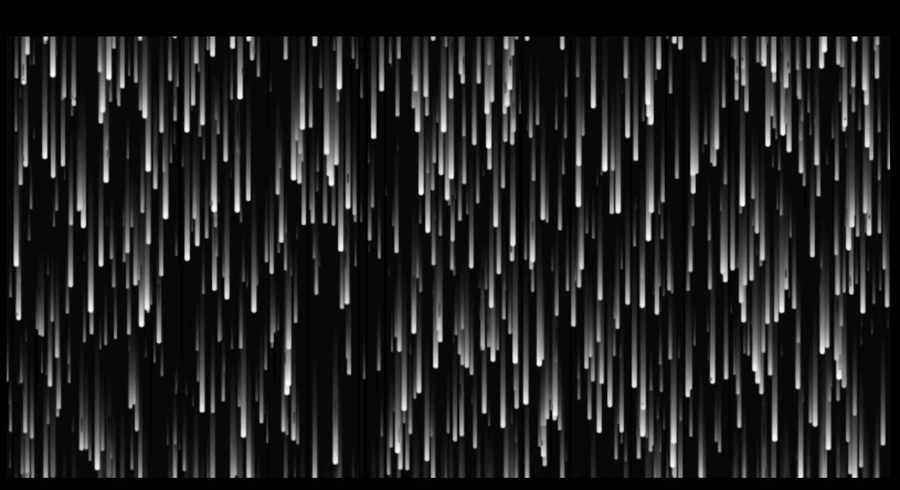

# yzho0820_9103_tut1

## Part 1
I want to incorporate the spacetime gravitational effects from **"Interstellar"** into my project. This involves using imaging techniques that depict the sensation of passage through relative velocities and light drag effects as the spacecraft traverses the stars around the black hole. I believe this is a highly beneficial technique because it will enhance the project's realism and captivating visual appeal, aligning perfectly with the assignment requirements. It will allow the audience to better grasp the thrilling journey of the spacecraft through the gravitational field of the black hole, making a significant contribution to the project's overall impact.

## Part 2
I draw inspiration from reference1, which involves reducing the opacity of the black background to preserve the historical trajectory. Additionally, reference2 has made me realize the potential of using three-dimensional space to build a spatial model. The reduced background opacity will emphasize the star's journey around the spacecraft, while the three-dimensional spatial model will provide depth and realism to the scene, enhancing the overall visual impact and immersion of the project. I believe that by combining these two techniques, I can effectively achieve the imagery of interstellar passage described in part1.

- reference 1：
    

    [https://openprocessing.org/sketch/101623](https://openprocessing.org/sketch/101623)

- reference 2:
    

    [https://openprocessing.org/sketch/107788](https://openprocessing.org/sketch/107788)
